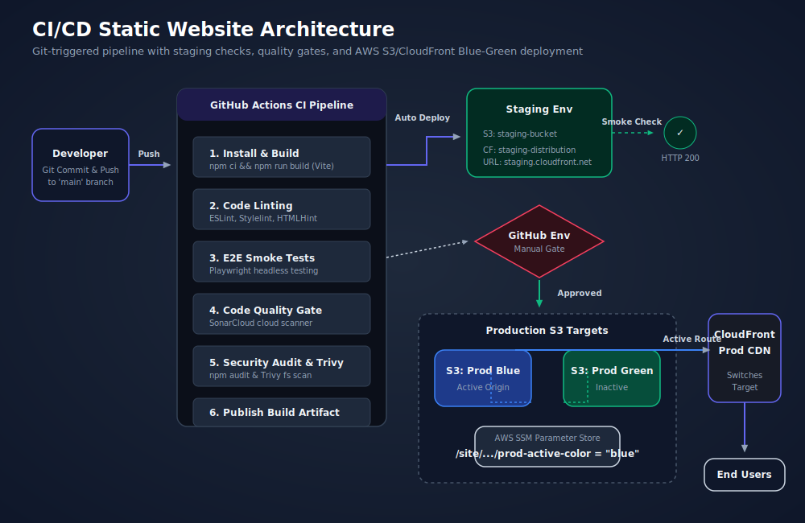

# Static Website CI/CD Pipeline (Blue-Green & Staging)

A complete, production-grade DevOps solution for hosting a high-performance, secure, static website on AWS S3 and CloudFront using a GitHub Actions CI/CD pipeline. Featuring OIDC authentication, automated linting/testing, SonarCloud quality analysis, Trivy security scanning, automated staging deployments, a manual approval checkpoint, and zero-downtime blue-green production promotions with instant rollback.

---

## 🏗️ Architecture Summary

The architecture leverages a decoupled design where code changes are packaged and promoted across isolated staging and production layers:

1. **Local Development**: Code is pushed to the `main` branch or a Pull Request is opened.
2. **GitHub Actions Runner**: Triggers a run that builds, lints (ESLint, Stylelint, HTMLHint), and runs E2E tests (Playwright) against a local server, followed by code quality checks (SonarCloud) and security scanning (Trivy + `npm audit`).
3. **Staging Deploy (Auto)**: Deploys automatically to a staging S3 bucket. Access is secured using a custom Referer header secret known only to CloudFront and the bucket policy.
4. **Manual Approval Gate**: Pauses pipeline execution before production using GitHub Actions Environments.
5. **Production Deploy (Blue-Green)**: Deploys to the inactive bucket (either Blue or Green) and performs a direct origin smoke check. Traffic is routed via CloudFront by dynamically rewriting the cache behavior target origin ID.

### System Diagram



---

## 🛠️ Prerequisites

To run and deploy this pipeline, you need:
- An **AWS Account** with CLI access and administrative permissions to create IAM, S3, CloudFront, and SSM resources.
- **Terraform CLI** (v1.2.0 or higher) installed locally.
- **Node.js** (v18.x or higher) and **npm** installed locally.
- A **SonarCloud Account** (free for public repositories) to get a `SONAR_TOKEN`.
- A **GitHub Repository** populated with this codebase.

---

## 🚀 Setup & Deployment Steps

### Step 1: Initialize and Deploy Infrastructure

Before the GitHub pipeline can run, we must bootstrap the AWS resources. The OIDC Provider and IAM Role must be created so that GitHub Actions can securely deploy to AWS.

Navigate to `infra/terraform/` and run:

```bash
# Initialize Terraform and download provider plugins
terraform init

# Validate configuration syntax
terraform validate

# Generate a preview of resource changes
terraform plan

# Deploy infrastructure to your AWS account
# Note: You can customize variables using -var or terraform.tfvars
terraform apply -auto-approve
```

Take note of the Terraform CLI output values:
- `github_actions_role_arn`
- `staging_bucket_name`
- `cloudfront_staging_distribution_id`
- `staging_url`
- `prod_blue_bucket_name`
- `prod_green_bucket_name`
- `cloudfront_prod_distribution_id`
- `production_url`
- `ssm_parameter_active_color_name`

---

### Step 2: Configure GitHub Secrets & Environments

1. **GitHub Environment Setup**:
   - Go to your GitHub repository -> **Settings** -> **Environments** -> Click **New environment**.
   - Name it exactly `production`.
   - Tick **Required reviewers** and add yourself (or designated approvers) to enforce the manual gate.

2. **Add GitHub Actions Repository Secrets**:
   Go to your repository -> **Settings** -> **Secrets and variables** -> **Actions** and add the following:

| Secret Name | Value to Provide | Source |
|---|---|---|
| `AWS_ROLE_ARN` | IAM role ARN for GitHub Actions | `github_actions_role_arn` (TF output) |
| `AWS_REGION` | AWS region where resources reside (e.g. `us-east-1`) | Variable |
| `STAGING_BUCKET_NAME` | Name of the staging bucket | `staging_bucket_name` (TF output) |
| `STAGING_DISTRIBUTION_ID` | CloudFront staging distribution ID | `cloudfront_staging_distribution_id` (TF output) |
| `STAGING_URL` | Staging CDN URL | `staging_url` (TF output) |
| `PROD_DISTRIBUTION_ID` | CloudFront production distribution ID | `cloudfront_prod_distribution_id` (TF output) |
| `BLUE_BUCKET_NAME` | Name of the blue S3 bucket | `prod_blue_bucket_name` (TF output) |
| `GREEN_BUCKET_NAME` | Name of the green S3 bucket | `prod_green_bucket_name` (TF output) |
| `BLUE_BUCKET_ENDPOINT` | Blue bucket website endpoint domain | `static-site-cicd-prod-blue-<hash>.s3-website-us-east-1.amazonaws.com` |
| `GREEN_BUCKET_ENDPOINT` | Green bucket website endpoint domain | `static-site-cicd-prod-green-<hash>.s3-website-us-east-1.amazonaws.com` |
| `PRODUCTION_URL` | Production CDN URL | `production_url` (TF output) |
| `SSM_PARAMETER_NAME` | SSM active color tracker name | `ssm_parameter_active_color_name` (TF output) |
| `SONAR_TOKEN` | Token for project analysis | Generated on SonarCloud dashboard |

---

### Step 3: Trigger the Pipeline

1. Add your files, commit, and push them to the `main` branch:
   ```bash
   git add .
   git commit -m "feat: initial commit of pipeline code"
   git push origin main
   ```
2. Open your repository's **Actions** tab. You will see the pipeline running:
   - **Build, Lint & Test** will compile assets, check lint rules, execute Playwright, and scan dependencies/code.
   - **Deploy to Staging** will execute automatically.
   - **Deploy to Production** will pause, requiring you to click **Review deployments** and approve the release.

---

## 🔄 Blue-Green Routing & Rollbacks

### How the Switch Works
1. When the production deploy step runs, it queries AWS SSM to find out which environment is active (tracked via the parameter `/site/static-site-cicd/prod-active-color`).
2. If `blue` is active, the script targets the `green` S3 bucket, uploads the build, and performs a direct smoke check.
3. It updates the CloudFront production distribution's default cache behavior origin target to the Green origin.
4. It issues a cache invalidation and sets the SSM parameter to `green`.

### Triggering a Rollback
If a critical production bug is detected and you need to revert to the previous version *instantly* without rebuilding:

1. Locate the **Job Summary** in your failed or completed production workflow run. A pre-compiled rollback instruction table is generated.
2. Authenticate with your AWS account locally, set the variables, and run:
   ```bash
   export PROD_DISTRIBUTION_ID="<your-prod-cloudfront-id>"
   export SSM_PARAMETER_NAME="/site/static-site-cicd/prod-active-color"
   ./scripts/rollback.sh
   ```
This updates CloudFront to point to the alternate S3 bucket, invalidates the CDN edge caches, and updates the SSM state, resulting in a rollback under 30 seconds with zero website downtime.